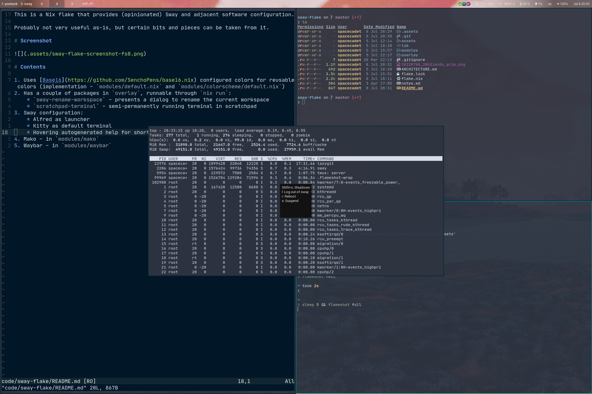

This is a Nix flake that provides (opinionated) Sway and adjacent software configuration.

Probably not very useful as-is, but certain bits and pieces can be taken from it.

# Screenshot

Screenshot with some terminal windows, a scratchpad hovering terminal and a help menu for `exit_ctl` mode:

# Contents

1. Uses [Base16](https://github.com/SenchoPens/base16.nix) configured colors for reusable colors (implementation - `modules/default.nix` and `modules/colorscheme/default.nix`)
2. Has a couple of packages in `overlay`, runnable through `nix run`:
    * `sway-rename-workspace` – presents a dialog to rename the current workspace
    * `scratchpad-terminal` – semi-permanently running terminal in scratchpad
3. Sway configuration:
    * Alfred as launcher
    * Kitty as default terminal
    * Hovering autogenerated help for shortcuts in modes using `yad`
4. Mako – in `modules/mako`
5. Waybar – in `modules/waybar`

# Overlay

Overlay contains a patched version of sway that corrects mouse and keyboard behavior with `hide_cursor` ([sway issue](https://github.com/swaywm/sway/issues/6297))
